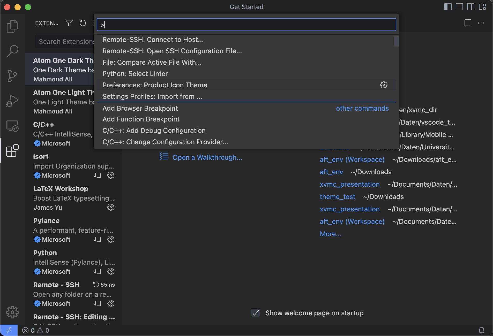
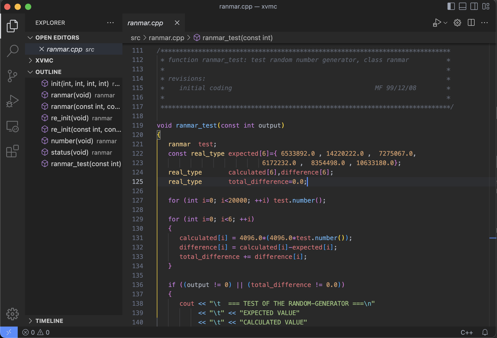
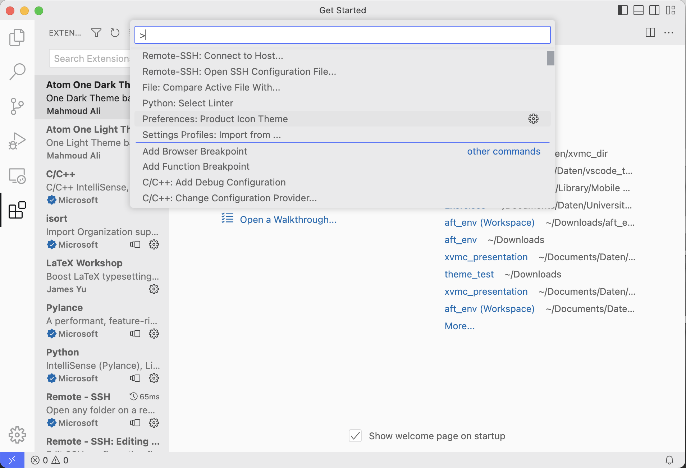
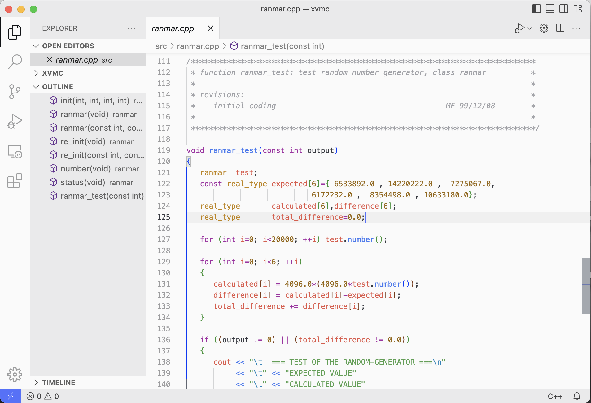

# Soft Grey Theme

**Soft Grey Theme** is a dynamic UI colour theme for Visual Studio Code. Based on the Atom One Dark/Light theme it follows the same syntax highlighting design language, but sets different accent colours. Colours are choosen from a grey colour palette rather than the blue grey palette of Atom.

For easy viewing in daylight it also comes with a light version.

## Installing

This extension is available in the [VS Code Marketplace](https://marketplace.visualstudio.com/vscode). 

## Features
* full workbench theme
* ships with light and dark theme
* extended syntax highlight support for LaTex and Python

This theme comes without an icon theme.

# Credits

This theme is based on the popular [Atom One Dark](https://github.com/akamud/vscode-theme-onedark) and [Atom One Light](https://github.com/akamud/vscode-theme-onelight) themes from [akamud](https://github.com/akamud)
